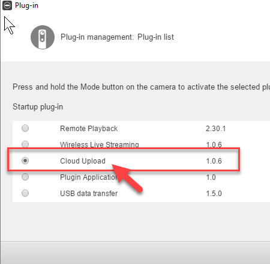
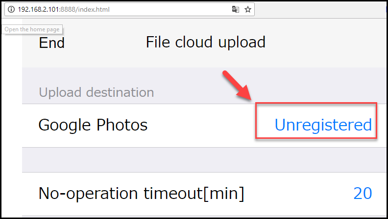
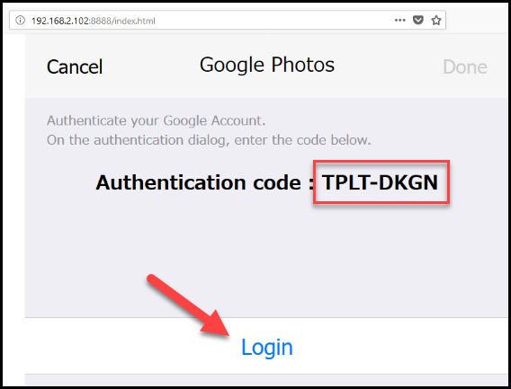
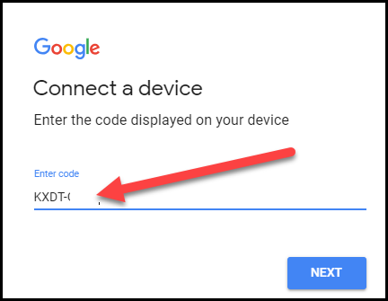
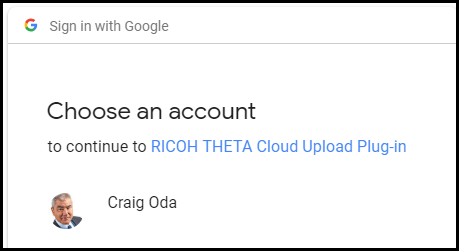
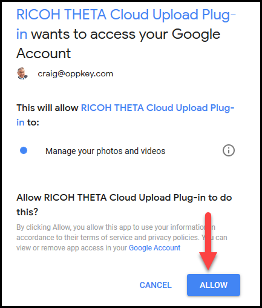
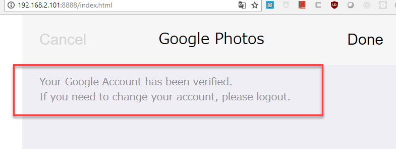
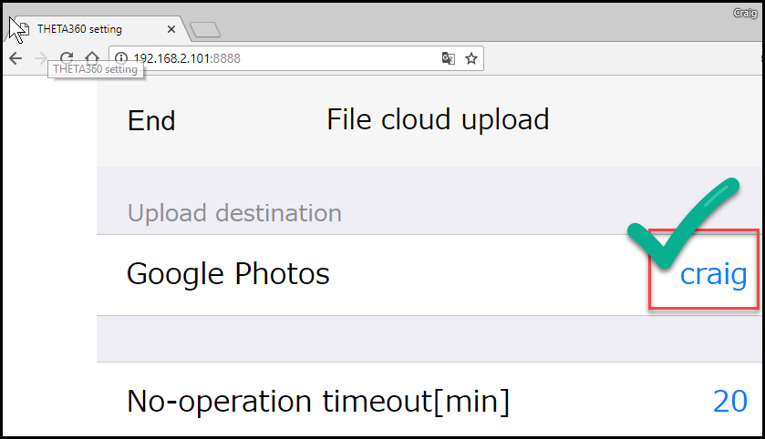

# Plug-in Configuration

Steps:

1. Connect RICOH THETA to Wi-Fi router in your home or office
2. Connect your mobile phone or workstation to the same Wi-Fi router
3. Obtain IP address of your RICOH THETA
4. Use web browser such as Google Chrome to connect to the IP address of your THETA
5. Authorize your THETA to connect with your Google Account
6. Start upload to Google Photos
7. Share your 360 images and celebrate

Connecting your THETA to your Wi-Fi router and obtaining the IP address is covered
in a previous section.  

A previous step also covers selecting the File cloud upload plug-in 
as the active plug-in.

The steps below cover configuration specific to the Cloud 
Upload plug-in and Google Photos.

## Authorize Your THETA 

Use a web browser to connect to the IP address of your THETA at port 8888.
If the IP address is 192.168.2.102, the full URL will be
`http://192.168.2.102:8888`.

### Register Plug-in with Google Account

If this is your first time using the Cloud Upload plug-in, you must register your new
plug-in. Press the *Unregistered* text next to Google Photos.

### Get Authentication Code

Your THETA needs to be connected to the Internet. With the THETA conected, you
will see the Authentication Code. Save this code in your clipboard or on a note.
Press login.

### Authorize Cloud Upload Plug-in

## Verify Authorization

You will see a confirmation screen that your account has been 
verified.

Your Google Account user name will appear next to *Google Photos* in the
web browser configuration application.

