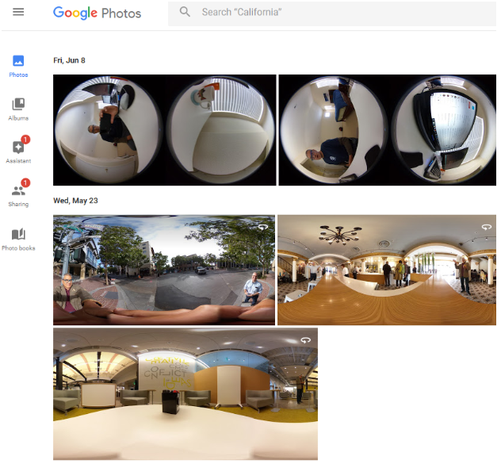
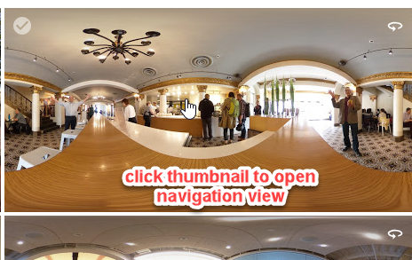
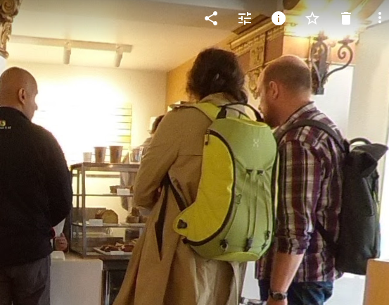
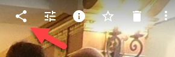
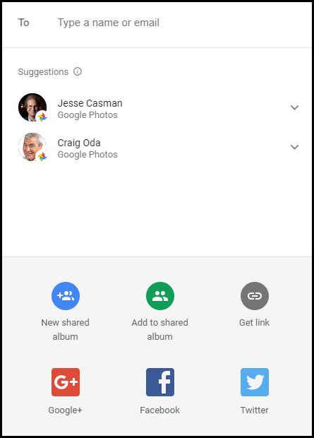

# Google Photos

Go to *photos.google.com* with a web browser. You'll be able to
see and share the images with your friends and family.

At the time of testing, the plug-in only works with photos
and does not upload 360 videos.

## Navigation and Sharing

Click on the equirectangular image thumbnail to open up the
360° image navigation view

You can use your mouse and scroll wheel to
navigate the image.

Press the share icon in the upper right corner to 
share the image by email or social media.

You will see a number of options for sharing your 360° image.

