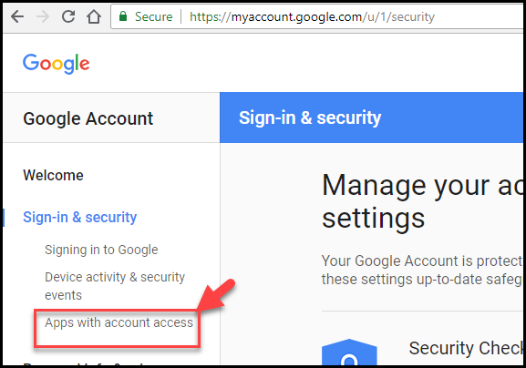
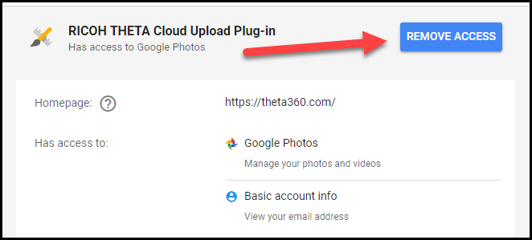

# Troubleshoot

## Remove Access

Although you should not need to remove account access to the 
plug-in, you may want to remove access and then authorize 
access again for testing.

If you want to remove access to the File cloud upload plug-in, go 
to https://myaccount.google.com

Select *Sign-in & security*. 
Select *Apps with account access*.

You'll be able to remove access to the plug-in.

