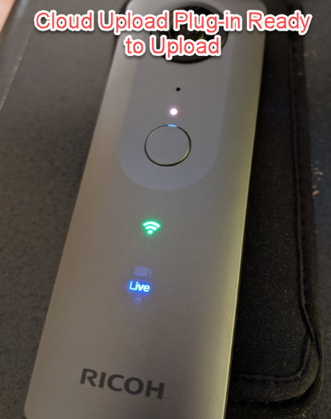
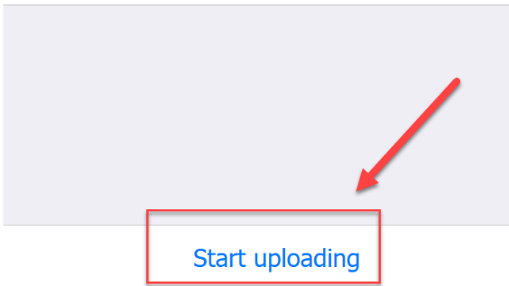
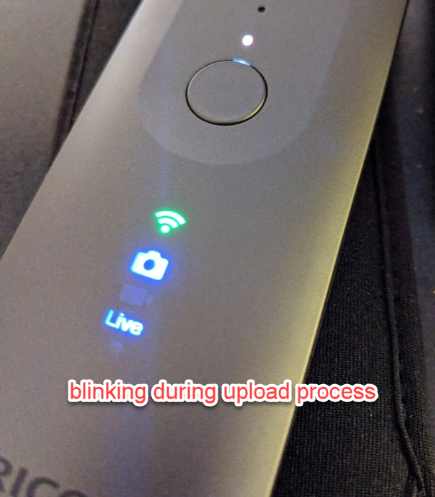
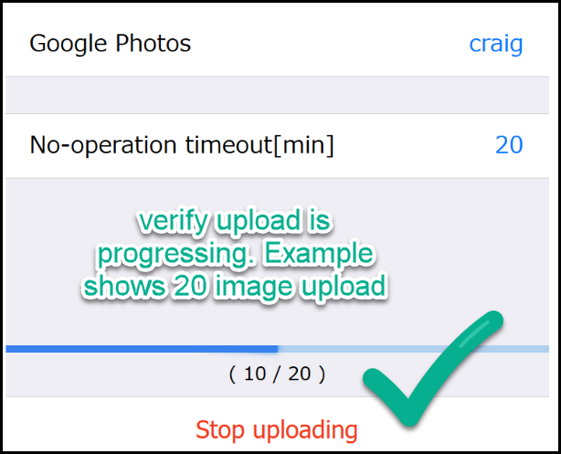

# Upload to Google Photos

With your THETA plug-in authorized with your Google Account, you
will see a solid green Wi-Fi LED and the solid blue *Live* LED
when your THETA is in plug-in mode.

## Verify THETA is Ready

If your THETA is not in a ready state, verify the 
following:

1. Cloud Upload plug-in is selected as active plug-in
2. THETA is in plug-in mode and there is a solid white LED above the shutter button
3. THETA V is connected to Internet. If your LED is flashing blue, press the Wi-Fi button on the side of the camera. The Wi-Fi LED will flash green initially, then be solid green when the connection is established
4. Your plug-in is authorized with your Google Account.

## Start Upload

You can use the shutter button to start the upload or press the button in the web browser.

## Verify Upload Progress

When your upload starts, you will see three blinking LEDs: green Wi-Fi, blue camera, blue Live.

In your web-based configuration too, you will also see a progress bar.

